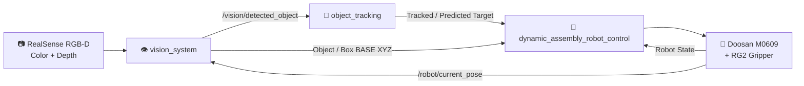
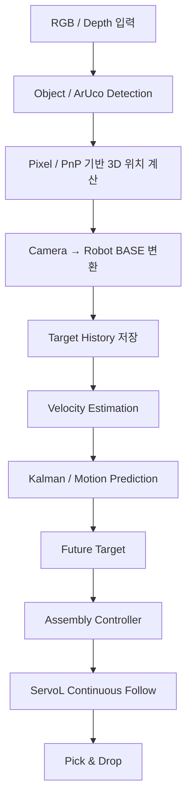
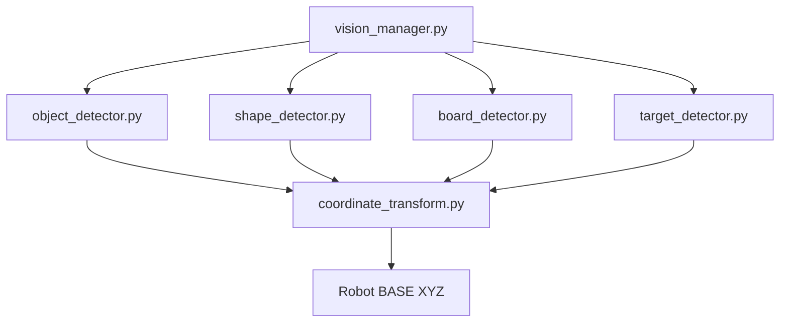
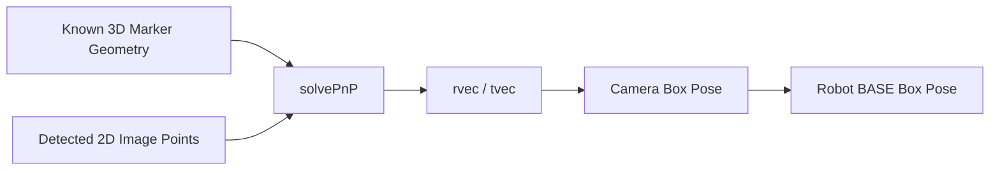
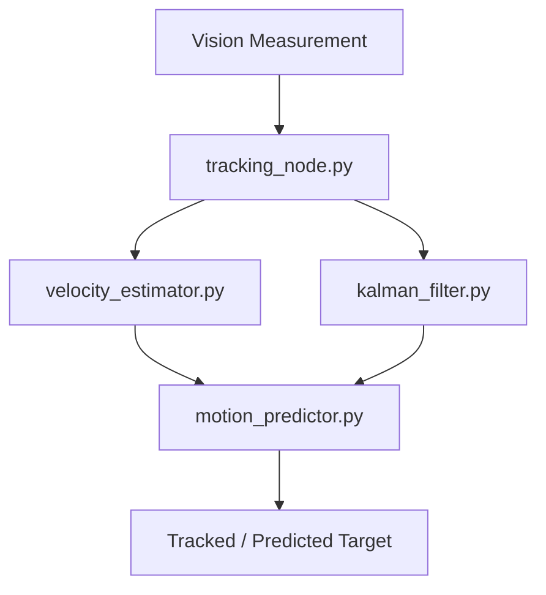
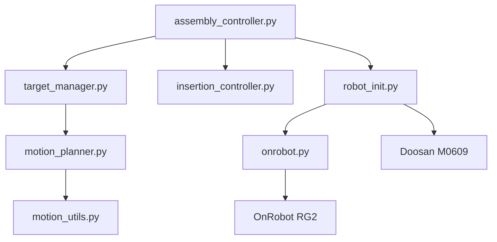
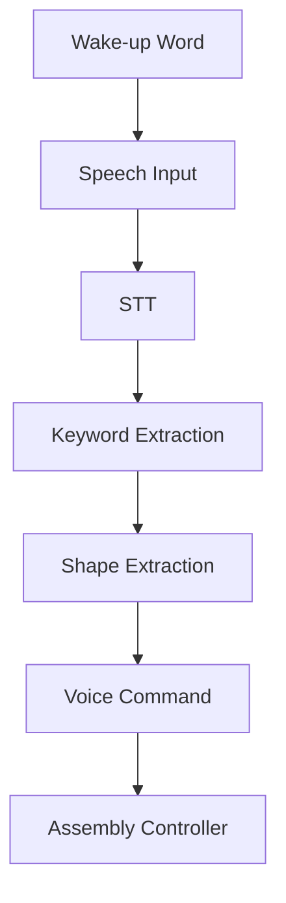
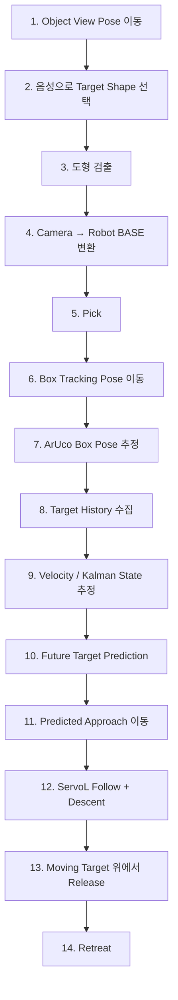

# 🤖 Dynamic Precision Assembly

> **OpenCV 기반 동적 타겟 실시간 추종 및 자율 정밀 조립 시스템**  
> ROS 2 기반으로 **비전 인식 → 3D 좌표 변환 → 타겟 추적/예측 → ServoL 연속 추종 → Pick & Drop**까지 통합한 로봇 비전 프로젝트입니다.

---

## 📌 프로젝트 개요

본 프로젝트는 **Doosan M0609 협동로봇**, **Intel RealSense RGB-D 카메라**, **OnRobot RG2 Gripper**, **OpenCV**, **ArUco Marker**, **ROS 2 Jazzy**를 이용하여  
정지 및 이동 환경에서 대상 물체와 이동 박스를 인식하고, 미래 위치를 예측하여 로봇이 실시간으로 추종하면서 정밀 Pick & Drop을 수행하도록 구현한 시스템입니다.

단순한 객체 검출이 아니라 아래의 전체 로봇 파이프라인을 구현하는 것을 목표로 합니다.

```text
Perception
   ↓
3D Reconstruction
   ↓
Coordinate Transformation
   ↓
Target Tracking / State Estimation
   ↓
Future Position Prediction
   ↓
ServoL Continuous Following
   ↓
Dynamic Pick & Drop
```

---

## ✨ 핵심 기능

| 기능 | 설명 |
|---|---|
| **RGB-D 기반 객체 인식** | RealSense Color / Depth 영상 수신 |
| **OpenCV 도형 검출** | circle / square / triangle / star 분류 |
| **ArUco 기반 박스 검출** | `DICT_4X4_250` 기반 Box Pose 추정 |
| **Occlusion-Tolerant Tracking** | ArUco 일부가 가려져도 Known Geometry로 Box Pose 유지 |
| **Eye-in-Hand 좌표 변환** | Pixel → Camera → Robot BASE 변환 |
| **속도 추정** | 타겟 위치 History 기반 이동 속도 계산 |
| **미래 위치 예측** | 등속 운동 모델 기반 Future Target 계산 |
| **Kalman Filter** | 위치 + 속도 상태 추정 및 노이즈/가림 상황 대응 |
| **ServoL 추종** | 이동 박스를 따라가면서 Cartesian Target 연속 갱신 |
| **Voice Command** | 음성 명령으로 작업 대상 도형 선택 |
| **ROS 2 모듈화** | Vision / Tracking / Control / Voice / Interface 패키지 분리 |

---

# 🧱 시스템 아키텍처



---

## 🧠 전체 데이터 흐름



---

# 📁 프로젝트 구조

```text
~/dynamic_assembly_ws/src
├── assembly_interfaces
│   ├── CMakeLists.txt
│   ├── include
│   │   └── assembly_interfaces
│   ├── msg
│   │   ├── DetectedObject.msg
│   │   ├── PredictedTarget.msg
│   │   ├── TrackedObject.msg
│   │   └── VoiceObject.msg
│   ├── package.xml
│   ├── src
│   └── srv
│       ├── SetLevel.srv
│       ├── StartAssembly.srv
│       ├── StopAssembly.srv
│       └── VoiceCommand.srv
│
├── dynamic_assembly_robot_control
│   ├── config
│   │   └── robot_params.yaml
│   ├── dynamic_assembly_robot_control
│   │   ├── assembly_controller2.py
│   │   ├── assembly_controller.py
│   │   ├── db_manager.py
│   │   ├── __init__.py
│   │   ├── insertion_controller.py
│   │   ├── motion_planner.py
│   │   ├── motion_utils.py
│   │   ├── onrobot.py
│   │   ├── robot_init.py
│   │   ├── target_manager.py
│   │   └── voice_motion_handler.py
│   ├── launch
│   │   └── dynamic_assembly_robot_control.launch.py
│   ├── package.xml
│   ├── resource
│   │   └── dynamic_assembly_robot_control
│   ├── setup.cfg
│   ├── setup.py
│   └── test
│
├── object_tracking
│   ├── config
│   │   └── tracking_params.yaml
│   ├── launch
│   │   └── tracking.launch.py
│   ├── object_tracking
│   │   ├── __init__.py
│   │   ├── kalman_filter.py
│   │   ├── motion_predictor.py
│   │   ├── tracking_node.py
│   │   └── velocity_estimator.py
│   ├── package.xml
│   ├── resource
│   │   └── object_tracking
│   ├── setup.cfg
│   ├── setup.py
│   └── test
│
├── test_pkg
│   ├── package.xml
│   ├── resource
│   │   └── test_pkg
│   ├── setup.cfg
│   ├── setup.py
│   ├── test
│   └── test_pkg
│       ├── __init__.py
│       └── test.py
│
├── vision_system
│   ├── config
│   │   ├── T_gripper2camera.npy
│   │   └── vision_params.yaml
│   ├── launch
│   │   └── vision.launch.py
│   ├── package.xml
│   ├── resource
│   │   └── vision_system
│   ├── setup.cfg
│   ├── setup.py
│   ├── test
│   └── vision_system
│       ├── board_detector.py
│       ├── coordinate_transform.py
│       ├── image_processing.py
│       ├── __init__.py
│       ├── object_detector.py
│       ├── shape_detector.py
│       ├── target_detector.py
│       └── vision_manager.py
│
└── voice_pkg
    ├── package.xml
    ├── resource
    │   ├── class_embeddings.json
    │   ├── hello_rokey_8332_32.tflite
    │   └── voice_pkg
    ├── setup.cfg
    ├── setup.py
    ├── test
    └── voice_pkg
        ├── audio_device.py
        ├── get_keyword.py
        ├── __init__.py
        ├── keyword_extraction.py
        ├── make_embeding.py
        ├── MicController.py
        ├── mic_test.py
        ├── shape_extractor.py
        ├── STT.py
        ├── voice_command_node.py
        └── wakeup_word.py
```

---

# 📦 패키지 구성

## 1. `assembly_interfaces`

프로젝트 전체에서 공통으로 사용하는 ROS 2 Custom Message / Service 패키지입니다.

### Messages

| Message | 역할 |
|---|---|
| `DetectedObject.msg` | 비전에서 검출한 Object / Box 정보 전달 |
| `PredictedTarget.msg` | 미래 위치가 예측된 Target 전달 |
| `TrackedObject.msg` | Tracking 상태 및 추정값 전달 |
| `VoiceObject.msg` | 음성 명령으로 선택된 Object 전달 |

### Services

| Service | 역할 |
|---|---|
| `SetLevel.srv` | LV1~LV4 동작 단계 설정 |
| `StartAssembly.srv` | 조립 시작 |
| `StopAssembly.srv` | 조립 중단 |
| `VoiceCommand.srv` | Voice Command 요청 |

---

# 👁️ Vision System

## `vision_system`

비전 입력, 도형 인식, ArUco Box 검출, 3D 위치 복원, Robot BASE 좌표 변환을 담당합니다.



### 주요 모듈

| 파일 | 역할 |
|---|---|
| `vision_manager.py` | Vision ROS 2 Node / 전체 처리 흐름 관리 |
| `object_detector.py` | Object Detection |
| `shape_detector.py` | 도형 분류 및 중심/각도 계산 |
| `board_detector.py` | ArUco Marker 및 Box Pose 추정 |
| `coordinate_transform.py` | Camera ↔ Robot BASE 좌표 변환 |
| `image_processing.py` | 영상 전처리 |
| `target_detector.py` | Target 추출 |

---

# 🔢 좌표 변환

## 1. Pixel → Camera Coordinate

RGB 이미지에서 검출된 픽셀 좌표를

\[
(u,v)
\]

라고 하고 해당 위치의 Depth를 \(Z\)라 하면,

\[
X_c =
\frac{(u-c_x)Z}{f_x}
\]

\[
Y_c =
\frac{(v-c_y)Z}{f_y}
\]

\[
Z_c = Depth(u,v)
\]

입니다.

여기서:

- \(f_x, f_y\): 카메라 초점 거리
- \(c_x, c_y\): Principal Point
- \(u,v\): 검출된 Pixel Coordinate
- \(Z\): Depth

따라서 Camera Frame의 3D 위치는

\[
P_c =
\begin{bmatrix}
X_c \\
Y_c \\
Z_c \\
1
\end{bmatrix}
\]

로 표현할 수 있습니다.

---

## 2. Camera → Robot BASE

본 시스템은 Eye-in-Hand 구조이므로,

```text
Robot BASE
    │
    │  B_T_G
    ▼
Gripper
    │
    │  G_T_C
    ▼
Camera
```

관계가 성립합니다.

따라서,

\[
{}^{B}T_C =
{}^{B}T_G
{}^{G}T_C
\]

이고,

\[
P_B =
{}^{B}T_C
P_C
\]

로 Camera Coordinate를 Robot BASE Coordinate로 변환합니다.

Hand-Eye Calibration 결과는 다음 파일에 저장됩니다.

```text
vision_system/config/T_gripper2camera.npy
```

---

# 🎯 ArUco 기반 Box Pose Estimation

박스에는 4개의 ArUco Marker가 배치되어 있습니다.

```text
ID 0 ---------------- ID 1
 |                      |
 |                      |
 |      BOX CENTER      |
 |                      |
 |                      |
ID 3 ---------------- ID 2
```

사용 Dictionary:

```text
DICT_4X4_250
```

ArUco Marker의 실제 3D Geometry와 영상에서 검출한 2D Point를 대응시켜 Box Pose를 계산합니다.



OpenCV에서는 다음과 같이 Pose를 추정합니다.

```python
cv2.solvePnP(
    object_points,
    image_points,
    camera_matrix,
    dist_coeffs,
    flags=cv2.SOLVEPNP_IPPE
)
```

Board Coordinate의 원점을 Box Center로 정의했기 때문에 `tvec`은 Camera 기준 Box Center의 위치를 나타냅니다.

---

# 🛡️ Occlusion-Tolerant ArUco Tracking

ArUco Marker가 로봇팔, Gripper, 물체 등에 의해 일부 가려져도 Tracking이 유지되도록 구현했습니다.

```text
4개 Marker Visible
        ↓
FULL Pose Estimate

3개 Marker Visible
        ↓
Partial Pose Estimate

2개 Marker Visible
        ↓
Known Geometry Estimate

1개 Marker Visible
        ↓
Minimal Pose Estimate

0개 Marker Visible
        ↓
Motion Prediction Fallback
```

Marker의 실제 크기와 배치 정보를 알고 있기 때문에 일부 Marker가 가려져도 Box Center와 Pose를 복원할 수 있습니다.

> ✅ **Occlusion-Tolerant Tracking 구현 및 실험 검증 완료**

---

# 🎯 Object Tracking

## `object_tracking`

이동 Target의 상태 추정과 미래 위치 계산을 담당합니다.



---

# 📈 LV3 — Constant Velocity Tracking

LV3에서는 Box가 등속 이동한다고 가정합니다.

두 측정 시점 간 속도는:

\[
v_x =
\frac{\Delta x}{\Delta t}
\]

\[
v_y =
\frac{\Delta y}{\Delta t}
\]

\[
v_z =
\frac{\Delta z}{\Delta t}
\]

미래 위치는:

\[
x_{future} =
x + v_x\Delta t
\]

\[
y_{future} =
y + v_y\Delta t
\]

\[
z_{future} =
z + v_z\Delta t
\]

로 예측합니다.

실제 구현에서는 단일 두 점만 사용하는 대신 여러 최근 Measurement History를 이용하여 속도 추정의 안정성을 높입니다.

---

# 🧮 LV4 — Kalman Filter

LV4에서는 Target의 **위치 + 속도**를 하나의 State로 정의합니다.

## State Vector

\[
x_k =
\begin{bmatrix}
p_x &
p_y &
p_z &
v_x &
v_y &
v_z
\end{bmatrix}^{T}
\]

---

## Prediction

\[
\hat{x}_k^{-}
=
A\hat{x}_{k-1}
\]

\[
P_k^{-}
=
AP_{k-1}A^T + Q
\]

---

## Kalman Gain

\[
K_k =
P_k^{-}H^T
\left(
HP_k^{-}H^T+R
\right)^{-1}
\]

---

## Update

\[
\hat{x}_k =
\hat{x}_k^{-}
+
K_k
\left(
z_k-H\hat{x}_k^{-}
\right)
\]

\[
P_k =
(I-K_kH)
P_k^{-}
\]

Kalman Filter를 사용하면 Measurement에 Noise가 존재하거나, 짧은 시간 동안 측정값이 사라지는 경우에도 이전 State와 Motion Model을 이용하여 안정적으로 Target을 추정할 수 있습니다.

---

# 🤖 Robot Control

## `dynamic_assembly_robot_control`

로봇의 작업 Sequence, Target 관리, Motion Command, Gripper 제어를 담당합니다.



### 주요 파일

| 파일 | 역할 |
|---|---|
| `assembly_controller.py` | 전체 조립 Sequence 제어 |
| `target_manager.py` | Target History / Velocity / Prediction |
| `motion_planner.py` | Motion Planning |
| `motion_utils.py` | 공통 Motion 계산 |
| `insertion_controller.py` | Insertion 동작 |
| `robot_init.py` | Doosan Robot 초기화 및 Motion API |
| `onrobot.py` | RG2 Gripper Interface |
| `voice_motion_handler.py` | Voice → Robot Motion 연결 |
| `db_manager.py` | 작업 / 실험 데이터 관리 |

---

# 🌀 ServoL Moving Target Follow

LV3 Drop 단계에서는 Box가 이동하는 동안 Robot TCP도 같은 XY 방향으로 이동하면서 Z 방향으로 하강합니다.

\[
x_r(t) =
x_0 + v_x t
\]

\[
y_r(t) =
y_0 + v_y t
\]

\[
z_r(t) =
z_{approach}
-
v_{drop}t
\]

즉, Robot TCP는 단순 수직 하강하지 않고 이동 Box를 따라가는 대각선 Cartesian 경로를 생성합니다.

```text
Box 이동 →

t0          t1          t2          t3
□ ────────→ □ ────────→ □ ────────→ □
              ↘
                ↘
                  ● Robot TCP
                    ↘
                      DROP
```

ServoL에 지속적으로 새로운 Target Pose를 전달하여 Continuous Cartesian Tracking을 수행합니다.

---

# 🎤 Voice Command

## `voice_pkg`

음성으로 Pick 대상 도형을 선택할 수 있습니다.



예시 Target:

```text
circle
square
triangle
star
```

---

# 🧪 동작 Level

| Level | 내용 |
|---|---|
| **LV1** | 정지 Target Pick & Drop |
| **LV2** | 접근 도중 Target 위치 변경에 대응 |
| **LV3** | 등속 이동 Target 실시간 추종 |
| **LV4** | Kalman Filter 기반 상태 추정 및 강인한 Tracking |

---

# 🔄 전체 실행 흐름



---

# 📡 주요 ROS 2 데이터 흐름

```text
RealSense
    │
    ▼
vision_system
    │
    ├── /vision/detected_object
    ▼
object_tracking
    │
    ├── TrackedObject
    └── PredictedTarget
    ▼
dynamic_assembly_robot_control
    │
    ▼
Doosan M0609
```

Robot State Feedback:

```text
Doosan Robot
      │
      ▼
/robot/current_pose
      │
      ├────────► Vision System
      └────────► Robot Controller
```

---

# ⚙️ Build

Workspace Root로 이동합니다.

```bash
cd ~/dynamic_assembly_ws
```

ROS 2 환경을 Source 합니다.

```bash
source /opt/ros/jazzy/setup.bash
```

Build:

```bash
colcon build --symlink-install
```

Build 후:

```bash
source install/setup.bash
```

Merged Install Layout을 사용하는 경우:

```bash
colcon build --merge-install --symlink-install
```

---

# 🌐 ROS 2 환경 설정

```bash
export ROS_DOMAIN_ID=99
export RMW_IMPLEMENTATION=rmw_cyclonedds_cpp
```

CycloneDDS 설정을 사용하는 경우:

```bash
export CYCLONEDDS_URI=~/.config/cyclonedds/cyclonedds.xml
```

---

# 🦾 Doosan Robot Bringup

```bash
ros2 launch m0609_rg2_bringup bringup.launch.py \
    mode:=real \
    host:=192.168.1.100 \
    model:=m0609 \
    port:=12345
```

---

# 📷 Vision 실행

```bash
ros2 launch vision_system vision.launch.py
```

또는:

```bash
ros2 run vision_system vision_manager
```

---

# 🎯 Tracking 실행

```bash
ros2 launch object_tracking tracking.launch.py
```

---

# 🤖 Robot Controller 실행

```bash
ros2 launch dynamic_assembly_robot_control \
    dynamic_assembly_robot_control.launch.py
```

Console Script가 등록되어 있는 경우:

```bash
ros2 run dynamic_assembly_robot_control assembly_controller
```

---

# 🧰 기술 스택

- ROS 2 Jazzy
- Ubuntu 24.04
- Python 3.12
- OpenCV
- Intel RealSense
- ArUco Marker
- NumPy
- Kalman Filter
- Doosan Robotics API
- OnRobot RG2
- ServoL
- PostgreSQL
- Voice Recognition / STT

---

# ✅ 구현 상태

| 기능 | 상태 |
|---|---|
| RGB-D Vision | ✅ |
| OpenCV Shape Detection | ✅ |
| Eye-in-Hand Coordinate Transform | ✅ |
| ArUco Box Pose Estimation | ✅ |
| Occlusion-Tolerant Tracking | ✅ 검증 완료 |
| LV3 Constant Velocity Tracking | ✅ |
| ServoL Continuous Follow | ✅ |
| Voice Command | ✅ |
| Kalman Filter Tracking | ✅ 구현 |
| Dynamic Pick & Drop | ✅ |

---

# 🚀 향후 개선

- Camera Frame ↔ Robot Pose Timestamp 동기화 강화
- Robot State Feedback Rate 향상
- Moving Camera 상태에서 Closed-Loop Visual Servoing
- Kalman Filter \(Q, R\) 자동 튜닝
- Shape별 Grasp Strategy 개선
- Force Feedback 기반 정밀 삽입
- Tracking Error 자동 평가
- 실험 결과 Dashboard 구축
- DB 기반 성능 비교 자동화

---

# 🎯 프로젝트 핵심

본 프로젝트의 핵심은 단순히 영상을 이용하여 Object를 검출하는 것이 아닙니다.

> **Perception → 3D Reconstruction → Coordinate Transformation → State Estimation → Prediction → Motion Control → Dynamic Assembly**

까지 이어지는 전체 로봇 Pipeline을 직접 설계하고 구현하는 것을 목표로 합니다.

정적 환경뿐 아니라 **이동, 가림, 센서 노이즈가 존재하는 동적 환경에서도 로봇이 Target의 상태를 추정하고 대응할 수 있는 구조**로 확장하였습니다.
